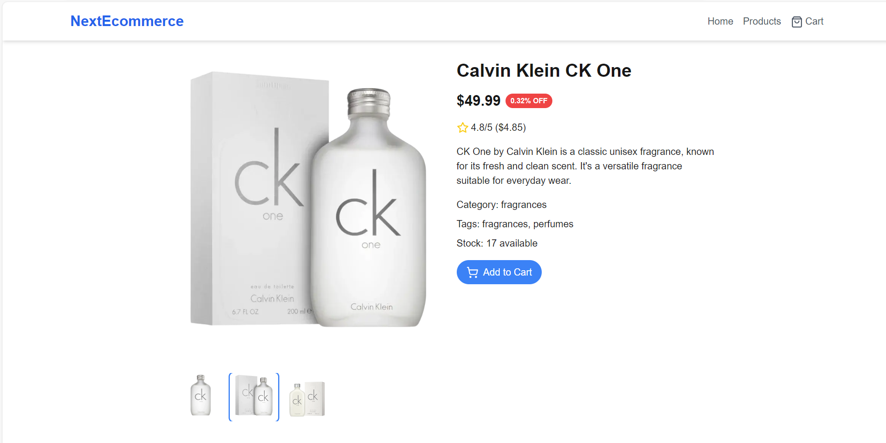

https://github.com/Phillip-tech/-PHIBOG534_JSE2407_Groupc_Phillip-Bogopane_FSJ01/blob/e0a9d567a345150ab3841942a6dac28eade9ada1/Products%20Image.png

# 🛍️ NextEcommerce - Modern E-commerce Platform

Welcome to **NextEcommerce**, an e-commerce platform built with **Next.js 14**. This platform allows users to explore a wide range of products, view detailed product information, and enjoy a seamless shopping experience. 

---

## 🔍 Overview
This project showcases key features including **pagination**, **product preview**, and **error handling** while integrating **server-side rendering** to deliver a highly responsive and user-friendly platform.

---

## ✨ Features (User Stories)

### 📦 **Data Fetching & State Management**
- **[Easy]** Fetch the first 20 products from [API](https://next-ecommerce-api.vercel.app/products)
- **[Hard]** Fetch the next 20 products as users paginate
- **[Medium]** Handle errors during product fetching with friendly error messages
- **[Medium]** Render product data server-side
- **[Medium]** Display loading state during data fetching

### 🎨 **UI/UX**
- **[Easy]** Display a grid of 20 products on the main page
- **[Hard]** Implement pagination controls with URL updates
- **[Medium]** Navigate to a detailed view of a product
- **[Hard]** Preview product images with scroll controls
- **[Easy]** Show price, category, description, tags, and availability on product pages
- **[Easy]** Display customer reviews on detailed product pages

---

## 🛠️ Technologies Used

- **Next.js 14** - App Router, Server Components
- **React** - Dynamic rendering, state management
- **Tailwind CSS** - Utility-first responsive design
- **Node.js** - Deployment and API hosting
- **JavaScript** - Core programming language

---

## 🎨 Styling & Design

We use **Tailwind CSS** for fast, scalable, and responsive design. The platform adapts across devices, providing a consistent user experience. Grid layouts, product cards, and pagination controls ensure easy navigation and visual clarity.

## 🚀 Installation & Setup

1. **Clone the repository:**
    ```bash
    git clone https://github.com/your-username/next-ecommerce.git
    ```


2. **Navigate into the directory:**
    ```bash
    cd next-ecommerce

3. **Install dependencies:**
    ```bash
    npm install
    ```
4. **Navigate into the directory:**
    ```bash
    npx create-next-app@latest
    ```

5. **Run the development server:**
    ```bash
    npm run dev
    ```

6. **Build the project:**
    ```bash
    npm run build
    ```

---

## 🌐 Usage

- **Product Listing Page:**
  Display the first 20 products fetched from the API, with pagination to view more.
  
  

- **Detailed Product View:**
  View detailed product information, including multiple images, descriptions, and reviews.
  
  

---

## 🎨 Styling Elements

- **Global Styling:** Located in `app/globals.css` and utilizes Tailwind CSS.
- **Responsive Design:** The grid layout adjusts based on the screen size, ensuring a consistent experience across mobile, tablet, and desktop.
- **Interactive Elements:** Hover effects, button states, and loading animations improve the user experience.

---

## ⚙️ Challenges Faced

- **Pagination & Data Fetching:** Ensuring smooth data loading with error handling when fetching products dynamically from the API.
- **Product Preview:** Implementing an image gallery for products with multiple images required handling edge cases for image loading and user interactions.
- **Server-Side Rendering (SSR):** Balancing client-side and server-side data fetching to optimize page load times and SEO.

---

## 📱 Responsive Design

The platform is designed to adapt to all screen sizes. Whether you're browsing from a mobile phone, tablet, or desktop, you'll enjoy a clean, intuitive experience.

---

## 💡 Reflections

This project helped me dive deep into **Next.js 14**'s App Router and Server Components, mastering server-side data fetching, and handling complex UI states. 

**Key Takeaways:**
- The flexibility of **Next.js 14** offers great control over SSR and CSR, making it ideal for modern web applications.
- The combination of **Tailwind CSS** and **Next.js** ensures both fast development and highly responsive design.

---

## 🖼️ Product Previews

Here's an example of the product listing page:

[(Product Page](https://github.com/Phillip-tech/-PHIBOG534_JSE2407_Groupc_Phillip-Bogopane_FSJ01/blob/e0a9d567a345150ab3841942a6dac28eade9ada1/Products%20View.png)](https://github.com/Phillip-tech/-PHIBOG534_JSE2407_Groupc_Phillip-Bogopane_FSJ01/blob/main/Product%20Detail%20View.png?raw=true)

And here's the detailed view of an individual product:


---

## 💻 Folder Structure

📂 next-ecommerce/ ├── 📂 app/ │ ├── 📂 components/ │ │ ├── ErrorMessage.js │ │ ├── Footer.js │ │ ├── Header.js │ │ ├── Loading.js │ │ ├── Pagination.js │ │ └── ProductCard.js │ ├── globals.css │ ├── layout.js │ ├── page.js │ └── products/ │ ├── [id].js │ └── page.js ├── 📂 public/ │ └── images/ ├── 📂 styles/ ├── package.json ├── next.config.js └── README.md
